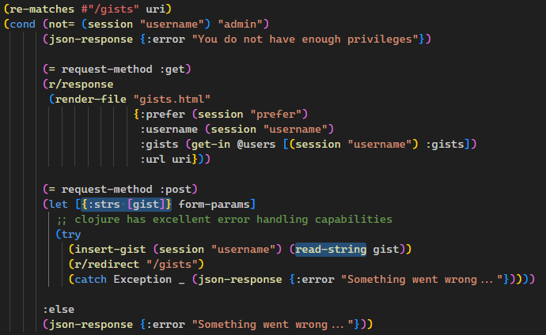
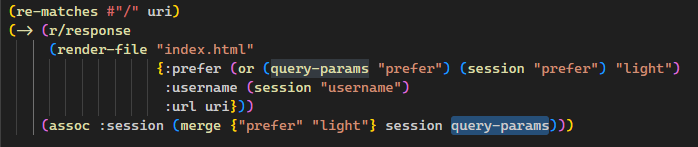

# Manifesto (Web - Easy)

Description:
> This is an easy challenge, except... it's written in Clojure. Can you find your way through all of these parentheses and come out victorious? - @aelmo

### What we have
* deployable instance running a webpage, with
    1. a home page (text wall about how great clojure is)
    2. log in page
    3. gist page (accessible only to admin)
    4. button to toggle light / dark mode
* docker container source code for the web app, written in clojure

### Where is the flag?
By reading the source code, we can see the flag is stored as a environment variable inside the docker container:
```docker
# Dockerfile
ENV FLAG '0xL4ugh{this_is_a_fake_flag}'
```

### Exploit

The biggest challenge is to dig through the cursed clojure code (average LISP unenjoyer).

By searching "clojure ctf" I found this [link](https://ctftime.org/writeup/11643) showing that the function `read-strings` evaluates user inputs unsafely. We can also find this function used in the source code, under the `/gists` page.



However, to get to the `/gists` page, our session username needs to be "admin".

By digging around the code we find a vulnerability in `/index` that merges all the provide query parameters into the session map. <br>



While this seems to be how the website handle light / dark mode through query parameters, it also
allows us to put anything inside the session map. So we can just send over 
`/index?prefer=light&username=admin`
to become admin and access the protected page, no password or log in required.


After we can access `/gists`, we can now give unsafe inputs to the `read-strings` function. Feel free to read the clojure docs as well as reference the [above writeup](https://ctftime.org/writeup/11643) for writing clojure code.

The final payload to give out the flag is `#=(eval (System/getenv "FLAG"))`. Then the flag string will be appended to the list of gists, which is

### Flag
> flag{7zEH5SnhimIpeQGduU8tAXfmaCB0CrV2}

(why different flag format lol)