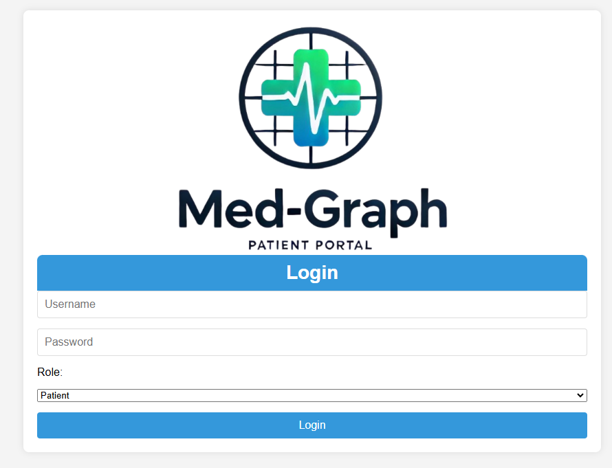
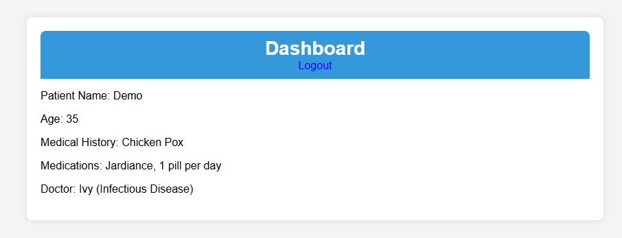
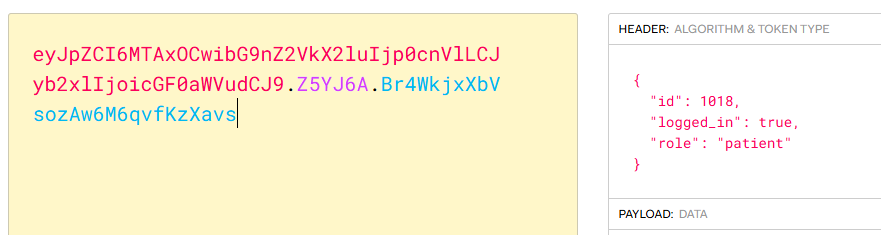
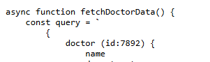
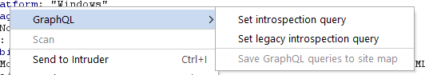
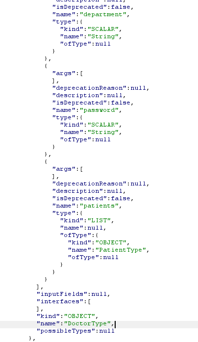
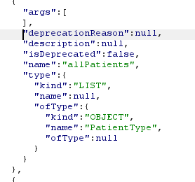
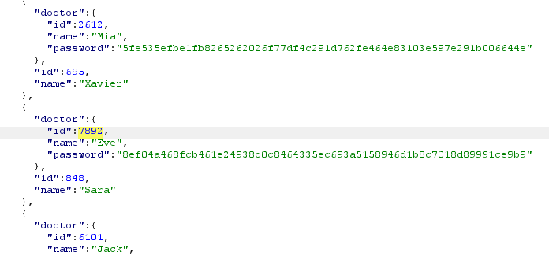
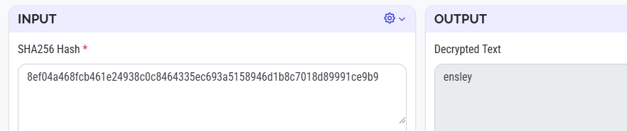
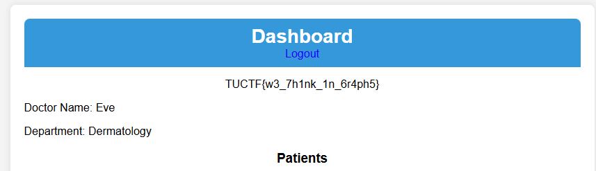

# Med Graph
Category: Web \
Difficulty: Easy (50 pts)

> My startup is launching the next big patient portal, using the hottest new tech! Check it out with our guest account: Demo:TUCTF. We're still in beta, but it's so secure we already have users! Note: This challenge requires no bruteforcing or intense scanning of the application.

https://med-graph.tuctf.com

### What We Know



The landing page for the challenge is a login prompt. We can log in using the provided credentials `Demo` and `TUCTF` and see a dashboard page.



On login, the dashboard page shows patient information and a log out button. The log-in state is maintained by a session cookie:


By poking around the sources, we see `dashboard.js` which contains some interesting network requests towards a backend API:

```html
<!-- dashboard.html -->
<script>window.onload = fetchPatientData;</script>
```

```js
// dashboard.js
async function fetchPatientData() {
    const query = `
        {
            userData {
                name
                age
                medicalHistory
                medications {
                    name
                    dosage
                    description
                }
                doctor {
                    name
                    department
                }
            }
        }
    `;

    const response = await fetch('/graphql', {
        method: 'POST',
        headers: {
            'Content-Type': 'application/json'
        },
        body: JSON.stringify({ query })
    });

    const result = await response.json();
    displayPatientInfo(result.data.userData);
}
```

It indicates some GraphQL backend for storing data, which contains information we need to access other parts of the system (such as a secret string or credentials for other accounts).

### Sus Number

In the script we also find another function: `fetchDoctorData` which interestingly points to a specific doctor by its Id of `7892`:



### GraphQL Introspection

Fine. We found out about the backend GraphQL API, we might want to know about the structure of the data in the database.

In fact, this is very convenient in burp suite when you right click on the request:



We can a long list of object types and fields, kind of like a database schema:



We can also get the "query types", which is like a view of the database (idk, graphql weird stuff). One of which is `allPatients` which gets us a list of, well, all patients.




### Leaking Password Hash
If we look at `DoctorType` and `PatientType` objects, we can see a field called `password`, which contains a string hash of the password.

We can get the passwords of many accounts by querying all patient data (which we have access to) and then selecting the `doctor` field in the `PatientType` object:

```graphql
query {
    allPatients {
        name
        id
        doctor {
            name
            id
            password
        }
    }
}
```



### Wait That's Illegal (?)

Now we have the password hash, what do we do with it? We already know the plain text password of the `Demo` account, which is `TUCTF`, and its hash `492d99acf39eb7d31f03a7ab0326943b13f47d3c16c907b5e7659e3cc9c5b46f`, one of  my teammate (🛐🛐🛐) somehow discovered that the password is just SHA-256 hash without salt.

Well, we also know the hash of the passwords of other accounts, can we get the plaintext so we could log in? Remember the hint of `id 7892`? If we put that hash into a SHA decrypt tool such as [iotools.cloud](https://iotools.cloud/tool/sha256-decrypt/) we can get the original password `ensley`.

> [!NOTE]
> The vulnerability here is the lack of salt in the password hash, coupled with the weak password, makes reversing the hash possible.



Log into doctor account id 7892 (whose name is `Eve`, can be easily leaked) and this password, we can get the flag:



### What We've Learned

- GraphQL Introspection
- GraphQL queries
- Always salt the password before hashing otherwise it's reversable