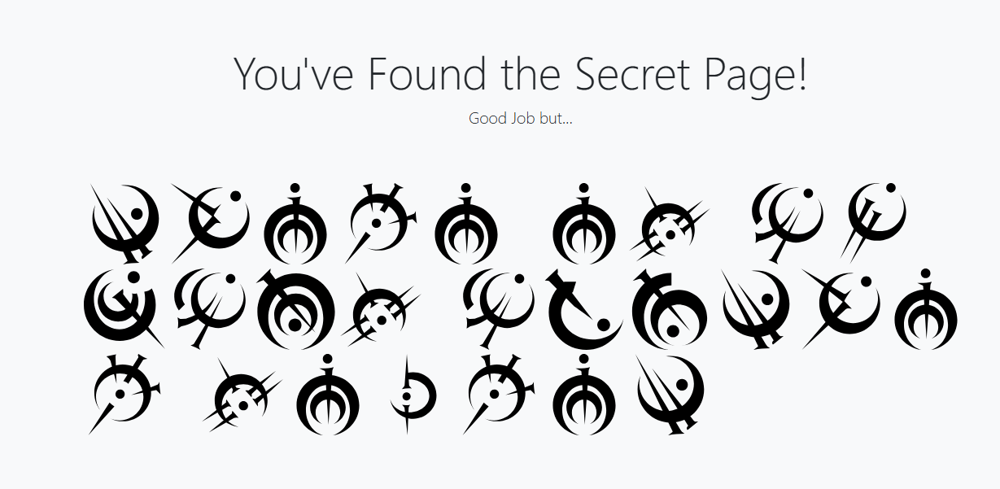
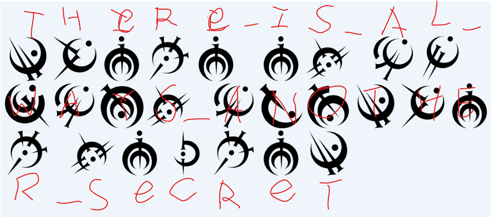

# My First Secret
Category: Web \
Difficulty: Easy (50 pts)

> A simple login page can you get past it? And remember there are secrets you will have to figure out. After you find the flag remember that the format is TUCTF{(FLAG)} and the if the flag has spaces use _ instead when submitting.

http://my-first-secret.tuctf.com

### Simple SQLi

We can go to the login page. Need to enter username and password. Bypass easily with simpliest form of SQL injection

Username: `' OR 1=1 -- ` \
Password: doesn't matter

Here's a [W3Schools tutorial](https://www.w3schools.com/sql/sql_injection.asp) of SQL injection

### Strange Characters

Upon login, we are redirected to `/secret` with a cryptic picture named `challenge.png`

We thought it was a stego challenge but some google image search later we found out about the **Steel Alphabet**, which translates the A-Z alphabet into the strange symbols above. Google that easily and spend some time looking back and forth.

### Flag

`TUCTF{THERE_IS_ALWAYS_ANOTHER_SECRET}`