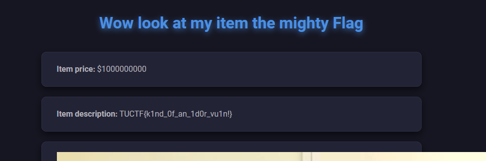

# Shopping Time
Category: Web \
Difficulty: Easy (50 pts)

> I finally got my online shop up and running, check it out and see what you like!

https://shopping-time.tuctf.com


### The Code

The attachment is a code which shows that the site is written in Python Flask. 

```py
@app.route("/review")
def reviewHandler():
    con = sqlite3.connect("shopping.db")
    cur = con.cursor()
    item = request.args.get("item")
    if item == "Flag":
        return("Blacklisted term detected")
    hash = hashlib.md5(item.encode()).hexdigest()
    result = cur.execute("SELECT * FROM items WHERE id=?", (hash[0:6],))
    try:
        result = result.fetchone()
        item = result[1]
    except:
        return (redirect("/"))
    return render_template("review.html",placeholder=item,price=result[2],desc=result[3],img=result[4])

```

The site takes in a `review` argument, whose query string is then hashed, and only the first 6 character is used to index a database. The code also suggests the item `Flag` has something interesting but we cannot directly input to the site.

### Exploit

Did you ever hear the tragedy of MD5 the wise? I thought not. It's not a story the javascript tutorials would tell you. Alright I'll stop. Basically MD5 hash is insecure and very vulnerable to collisions, and when the app only takes the first 6 characters of a hash, there is great chance of us finding a string that isn't `Flag` but has the same MD5 hash in the first 6 characters. 

Armed with this knowledge, we can easily write a python string generator that keeps spitting out strings, we hash it and check against the MD5 hash of `Flag` in the first 6 characters.

### Solve Script ~~(courtesy of copilot)~~

```py
import hashlib
import string
import itertools

def get_md5_hash_prefix(value, length=6):
    return hashlib.md5(value.encode()).hexdigest()[:length]

# Generator for strings of increasing length in ASCII printable range
def ascii_string_generator():
    chars = string.printable[:95]  # ASCII printable characters (32-126)
    length = 1
    while True:
        for s in itertools.product(chars, repeat=length):
            yield ''.join(s)
        length += 1

# Dictionary to store hash prefixes and their corresponding strings
flg_hash = get_md5_hash_prefix("Flag")

# Check for collisions
generator = ascii_string_generator()
while True:  # Limit to 1000 strings for demonstration
    s = next(generator)
    # print(s)
    prefix = get_md5_hash_prefix(s)
    if prefix == flg_hash:
        print(s)
        exit()
```

We quickly find one: `9e=<`, put it in the query string, and get the flag

### Flag

`https://shopping-time.tuctf.com/review?item=9e=%3C`

