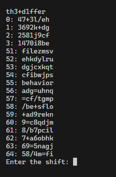

# Many Caesars

Category: cryptography \
Difficulty: Easy

> I took an old cipher and modified it to make it secure again. \
By breaking the regular patterns I made sure the known attacks don't work. \
Now I can use it to encrypt texts with my favourite Chat partner.

Attachment: `chall.py` (encryption program), `output.txt`

## Analysis

```py
import string
import re

text = open('text.txt','r').read().lower()
flag = open('flag.txt','r').read().strip()[4:-1].replace('_','+')
chars = string.ascii_letters + string.digits + '+/='
regex = re.compile('[' + chars + ']{5,70}')
assert re.fullmatch(regex, flag)

def caesar(msg, shift):
    return ''.join(chars[(chars.index(c) + shift) % len(chars)] for c in msg)

i = 0    # index of text
count = 0    # index of flag
while i < len(text):
    if text[i] not in string.ascii_lowercase:    # skip lowercase characters
        print(text[i], end = '')
        i += 1
    else:
        j = i
        while text[j] in string.ascii_lowercase: j += 1    # find the end of the word (of recognized characters)
        print(caesar(text[i:j], chars.index(flag[count % len(flag)])), end = '')
        count += 1
        i = j
```

Instead of traditional caesar cipher which shifts the whole text by a certain offset in the A-Z letter set, this cipher has a bigger character set (A-Za-z0-9+/=), and has a different shift by each word (where words are all lower case ascii letters). Each word is shifted by the flag content. For example, if the first character of the flag is `a` (which is first letter in the letter set), the plaintext is offset by 1.

Therefore, if we can reverse the plaintext from the ciphertext, we can obtain the shift of each word, which is the flag itself.

## Solve Script

```py
import string
import re
import os

text = 'AtvDxK lAopjz /i + vhw c6 uwnshnuqjx ymfy kymhi Kyv 47+3l/eh Bs kpfkxkfwcnu Als 9phdgj9 +ka ymzuBGxmFq 6fdglk8i CICDowC, sjxir bjme+pfwfkd 6li=fj=kp, nCplEtGtEJ, lyo qeb INKLNBM vm ademb7697. ollqba lq DitCmA xzhm fx ef7dd7ii, wIvv eggiww GB kphqtocvkqp, 3d6 MAx ilsplm /d rpfkd vnloov hc nruwtAj xDxyjrx vexliv KyrE +3hc Gurz, jcemgt ixlmgw 9f7gmj5/9k obpmlkpf/ib mzp 8k/=64c ECo sj qb=eklildv. =k loGznlEpD qzC qo+kpm+obk=v, vHEEtuHKtMBHG, huk h7if75j/d9 mofs+=v, zkloh lqAkwCzioqvo rfqnhntzx fhynAnynjx b/a7 JKvrCzEx hexe BE ecwukpi 63c397. MAxLx wypujpwslz 3/c ql irvwhu 9bbcj1h9cb fsi f tswmxmzi zDGrtK ed FBpvrGL vjtqwij ixlmgep 5f8 =lkpqor=qfsb tmowuzs.'
flag = []
chars = string.ascii_letters + string.digits + '+/='
# 'abcdefghijklmnopqrstuvwxyzABCDEFGHIJKLMNOPQRSTUVWXYZ0123456789+/='

def caesar(msg, shift):
    return ''.join(chars[(chars.index(c) + shift) % len(chars)] for c in msg)

i = 0    # index of text
count = 0    # index of flag
while i < len(text):
    if not text[i] in chars:    # skip lowercase characters
        i += 1
    else:
        j = i
        while text[j] in chars: j += 1    # find the end of the word (of recognized characters)
        # print(caesar(text[i:j], chars.index(flag[count % len(flag)])), end = '')
        os.system('clear')
        print(''.join(chars[i] for i in flag))
        for k in range(len(chars)):
            tmp = f'{k}: {caesar(text[i:j], -k)}'
            if tmp.islower():
                print(tmp)
        flag.append(int(input('Enter the shift: ')))
        count += 1
        i = j
```

You need to find the shift of each word by recognizing the correct shift that would produce a plaintext that "makes sense". For example, in the following step, `behavior` (shift 55) produces a plaintext that is proper English.



Remember that the underscores `_` in the flag is replaced by plus signs `+`.

## Flag

`ENO{th3_d1ffer3nce5_m4ke_4ll_th3_diff3renc3}`

In case you wonder what the plain text is:

`hacker ethics is a set of principles that guide the behavior of individuals who explore and manipulate computer systems, often emphasizing curiosity, creativity, and the pursuit of knowledge. rooted in values such as openness, free access to information, and the belief in using skills to improve systems rather than harm them, hacker ethics encourages responsible and ethical use of technology. it advocates for transparency, collaboration, and respecting privacy, while discouraging malicious activities like stealing data or causing damage. these principles aim to foster innovation and a positive impact on society through ethical and constructive hacking.`
