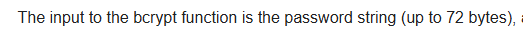
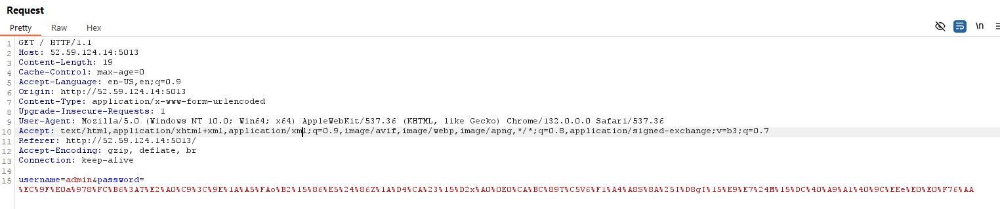
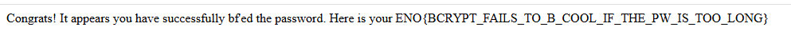

# Bfail

Difficulty: Easy \
Category: Web

> To 'B' secure or to 'b' fail? Strong passwords for admins are always great, right? \
Author: @gehaxelt

`http://52.59.124.14:5013`

## BCrypt

```py
from flask import Flask, request, redirect, render_template_string
import sys 
import os 
import bcrypt 
import urllib.parse 
app = Flask(__name__) 
app.secret_key = os.urandom(16); # This is super strong! The password was generated quite securely. Here are the first 70 bytes, since you won't be able to brute-force the rest anyway... 
# >>> strongpw = bcrypt.hashpw(os.urandom(128),bcrypt.gensalt()) 
# # >>> strongpw[:71] # b'\xec\x9f\xe0a\x978\xfc\xb6:T\xe2\xa0\xc9<\x9e\x1a\xa5\xfao\xb2\x15\x86\xe5$\x86Z\x1a\xd4\xca#\x15\xd2x\xa0\x0e0\xca\xbc\x89T\xc5V6\xf1\xa4\xa8S\x8a%I\xd8gI\x15\xe9\xe7$M\x15\xdc@\xa9\xa1@\x9c\xeee\xe0\xe0\xf76' 

app.ADMIN_PW_HASH = b'$2b$12$8bMrI6D9TMYXeMv8pq8RjemsZg.HekhkQUqLymBic/cRhiKRa3YPK' 
FLAG = open("flag.txt").read(); 

@app.route('/source') 
def source(): 
    return open(__file__).read() 

@app.route('/', methods=["GET"]) 
def index(): 
    username = request.form.get("username", None) 
    password = request.form.get("password", None) 
    if username and password: 
        username = urllib.parse.unquote_to_bytes(username) 
        password = urllib.parse.unquote_to_bytes(password) 
    if username != b"admin": 
        return "Wrong user!" 
    if len(password) > 128: 
        return "Password too long!" 
    if not bcrypt.checkpw(password, app.ADMIN_PW_HASH): 
        return "Wrong password!" 
    return f"""Congrats! It appears you have successfully bf'ed the password. Here is your {FLAG}""" # Use f-string formatting within the template string template_string = """
```

We immediately know the username is `admin`.

We are given the first 71 bytes of a 128 byte password, as well as its BCrypt hash (and salt).

However, even though the password is 128 bytes, BCrypt can only hash up to 72 bytes:



(Just looked up from wiki)

Thus, we only need to bruteforce the last (72nd) byte of the password, check against the hash and be good.

## Solve Script

```py
import os 
import bcrypt 
import urllib.parse 

known = b'\xec\x9f\xe0a\x978\xfc\xb6:T\xe2\xa0\xc9<\x9e\x1a\xa5\xfao\xb2\x15\x86\xe5$\x86Z\x1a\xd4\xca#\x15\xd2x\xa0\x0e0\xca\xbc\x89T\xc5V6\xf1\xa4\xa8S\x8a%I\xd8gI\x15\xe9\xe7$M\x15\xdc@\xa9\xa1@\x9c\xeee\xe0\xe0\xf76'

ADMIN_PW_HASH = b'$2b$12$8bMrI6D9TMYXeMv8pq8RjemsZg.HekhkQUqLymBic/cRhiKRa3YPK' 

for i in range(256):
    password = known + bytes([i])
    if bcrypt.checkpw(password, ADMIN_PW_HASH): 
        print(urllib.parse.quote(password))
        exit()
```

We quickly find the password is (url encoded:)
`%EC%9F%E0a%978%FC%B6%3AT%E2%A0%C9%3C%9E%1A%A5%FAo%B2%15%86%E5%24%86Z%1A%D4%CA%23%15%D2x%A0%0E0%CA%BC%89T%C5V6%F1%A4%A8S%8A%25I%D8gI%15%E9%E7%24M%15%DC%40%A9%A1%40%9C%EEe%E0%E0%F76%AA`

## Sending Request

Strangely the form makes POST request but only GET is defined. Change it in Burp Suite and send off the payload.





## Flag

`ENO{BCRYPT_FAILS_TO_B_COOL_IF_THE_PW_IS_TOO_LONG}`

## What We Learned

* Some password hashing algo have a length limit

## References

[BCrypt Wikipedia Page](https://en.wikipedia.org/wiki/Bcrypt)
