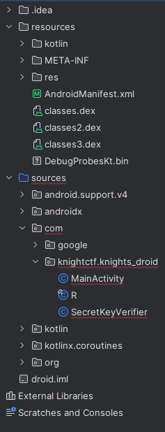
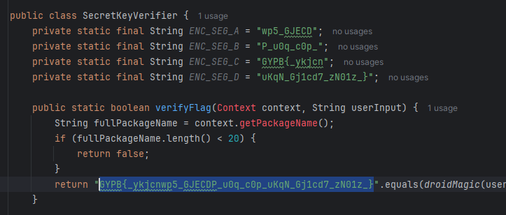

# Knght's Droid
Category: Reverse Engineering \
Difficulty: Very Easy (50 pts)

Simple Android apk rev challenge. We are given one apk `knights_droid.apk`.

### Reversing apk files

There are common tools to decompile apk files, even available online. For this chal I used [http://www.javadecompilers.com/apk](http://www.javadecompilers.com/apk) (third party website). Then can download decompiled project folder.

### Reading source

We get a typical android project structure. By searching for keyword "flag" we can find a method called `verifyFlag` in the `SecretKeyVerifier` class. In the return statement, we can find a string which looks like a flag.

### Flag
Looks like a simple caesar cipher. By decrypting (haha) it we get the actual flag which is `KCTF{_congrat5_KNIGHT_y0u_g0t_yOuR_Kn1gh7_dR01d_}`